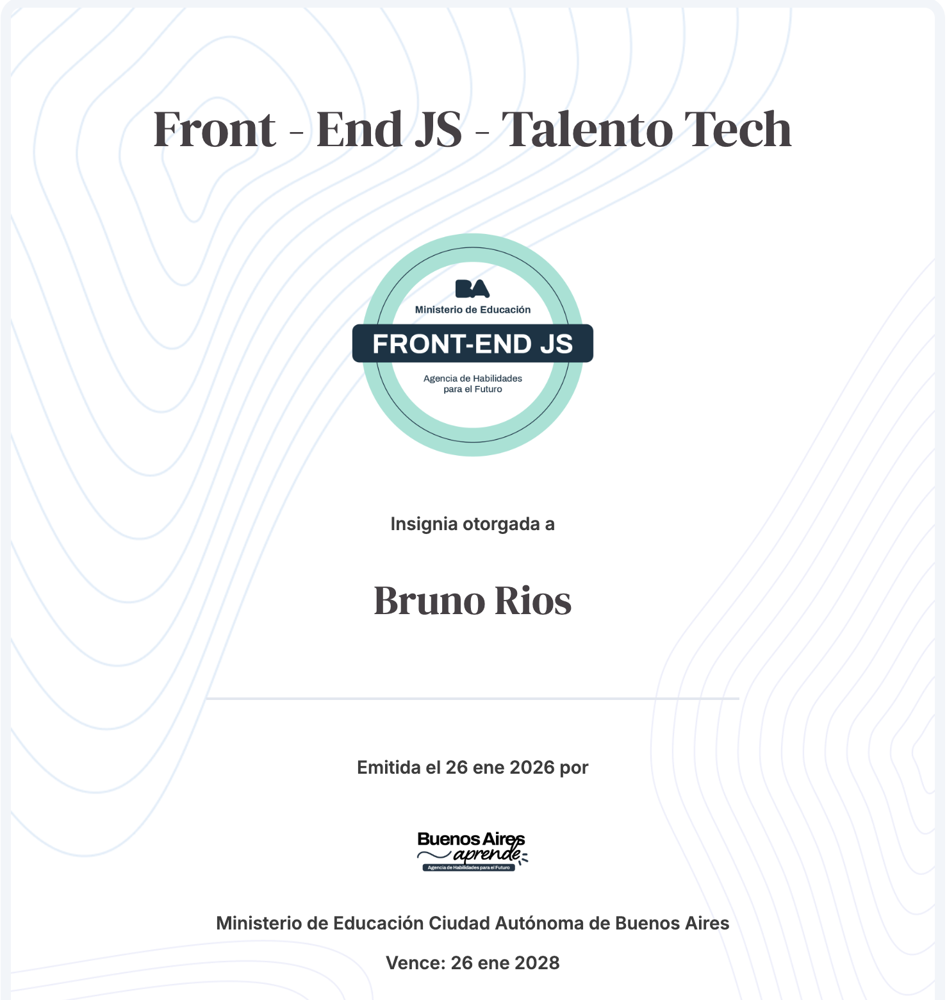
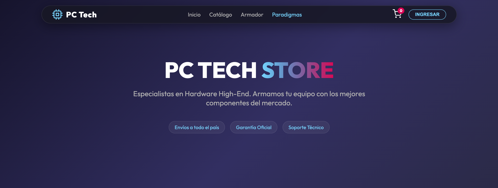
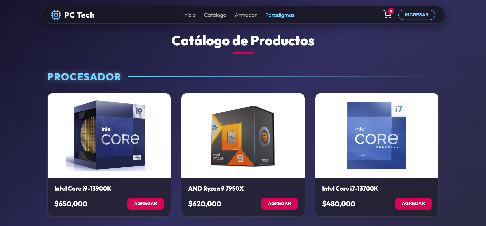
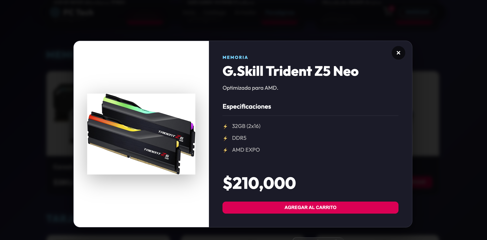
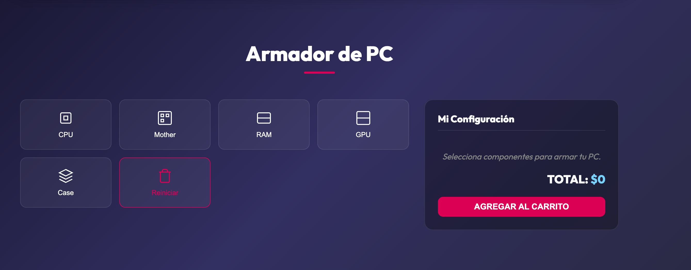

# Hola, soy Bruno Ríos

**Estudiante de Gestión de Tecnologías de la Información en la UNPAZ | Software Developer**

---

## Sobre mí

Soy estudiante de la carrera de **Lic. en Gestión de Tecnologías de la Información** en la Universidad Nacional de José C. Paz (UNPAZ), con una formación sólida en curso y en constante desarrollo.

Me apasiona la tecnología desde un enfoque integral, combinando conocimientos de **hardware** y **desarrollo de software**. Tengo experiencia en el armado, mantenimiento y optimización de equipos, lo que me permite comprender los sistemas desde la infraestructura hasta las aplicaciones.

Tengo un fuerte interés en el área de **redes** y en **bases de datos**, donde continúo formándome y profundizando conocimientos.

Trabajo habitualmente en entornos **Linux** y utilizo **Docker** para la gestión de contenedores, lo que me permite desenvolverme en ambientes modernos de desarrollo.

Actualmente, me encuentro enfocado tanto en las **materias de la carrera** como en mi formación práctica, realizando un curso de **React** en **Talento Tech**, con el objetivo de consolidarme como desarrollador **Full Stack**.

## Formación y enfoque

- **Formación:** Completé el trayecto de Front-End JS en Talento Tech y actualmente me encuentro especializándome en React.
- **Enfoque actual:** Desarrollo de interfaces reactivas y gestión de estados para mejorar la experiencia de usuario.
- **Stack principal:** JavaScript y Python, priorizando código limpio, modular y mantenible.

---

## Stack Tecnológico

### Frontend

  
  
  
  
  

### Backend y Bases de Datos

  
  
  
  
  

### Infraestructura y Herramientas

  
  
  
  

---

## Certificaciones Destacadas

<table border="0" cellpadding="0" cellspacing="0" width="100%">
  <tr>
    <!-- Certificado 1: Front-End JS -->
    <td align="center" valign="bottom" width="50%">
      
        
      <b>Insignia Front-End JS</b> Talento Tech
    </td>
    
    <!-- Certificado 2: React JS -->
    <td align="center" valign="bottom" width="50%">
      
        
      <b>Certificación React JS (80 hs)</b> Ministerio de Educación
    </td>
  </tr>
</table>

---

---

## Estadísticas de GitHub

  
  

  

---

## Contacto

  

---

  

---

## Proyecto Destacado: PC Tech Store

> **Entrega Final - Programa Talento Tech (Buenos Aires)** > Esta plataforma es una solución integral de E-commerce para hardware de alto rendimiento, optimizada para una navegación fluida y una gestión de datos reactiva.
> ## Para verlo en funcionamiento haga click aquì https://brunorios21.github.io/Entrega-Final-Talento-Tech/index.html

  

### Especificaciones del Desarrollo y Arquitectura
La arquitectura de este proyecto aplica los conceptos core de **JavaScript Moderno (ES6+)** desarrollados durante el trayecto formativo en Talento Tech:

#### 1. Gestión de Datos mediante Objetos Literales
Se implementó una estructura de datos robusta para la representación técnica de cada componente:
* **Encapsulamiento:** Agrupación de atributos críticos (precio, stock, descripción) dentro de una única unidad lógica.
* **Acceso Dinámico:** Uso de notación de corchetes `objeto[key]` para permitir la búsqueda de propiedades mediante variables dinámicas, facilitando la interacción entre la interfaz y la lógica de negocio.

#### 2. Procesamiento de Colecciones (Paradigma Funcional)
Se priorizó el uso de **Higher-Order Functions** para garantizar un código declarativo y eficiente:
* **Método `.filter()`:** Implementación de lógica de filtrado multivariable (precio, categoría y disponibilidad).
* **Método `.find()`:** Optimización en la recuperación de identificadores únicos para la gestión del carrito, deteniendo la iteración tras la primera coincidencia para mejorar el rendimiento.

#### 3. Sintaxis Moderna y Eficiencia
* **Arrow Functions:** Implementación de funciones flecha para simplificar callbacks y mantener un contexto léxico claro.
* **Clean Code:** Estructura de funciones modulares que separan la lógica de procesamiento de datos de la manipulación del DOM.

---

###  Galería del Sistema

<table align="center">
  <tr>
    <td width="50%">
      
       <b>Catálogo Dinámico:</b> Renderizado mediante consumo de API y filtrado en tiempo real.
    </td>
    <td width="50%">
      
       <b>Detalle Técnico:</b> Modal con recuperación de datos estructurados por ID.
    </td>
  </tr>
  <tr>
    <td colspan="2" align="center">
      
       <b>Configurador de Hardware:</b> Lógica de estado complejo para validación de compatibilidad entre componentes.
    </td>
  </tr>
</table>

---

## Enlaces del Proyecto

  
  &nbsp;&nbsp;
  

  
  
  

---
<h4 align="center">“La innovación nace del aprendizaje constante y la pasión por construir algo mejor.”</h4>
